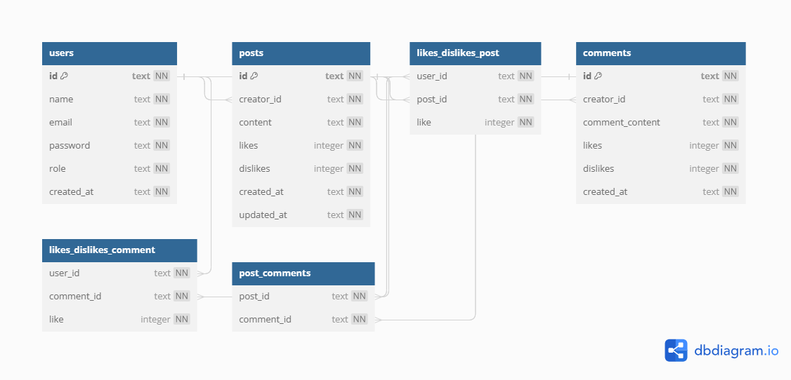

# Projeto Labeddit-Backend

O Labeddit é uma rede social que permite aos usuários fazer postagens em texto, com a opção de receber likes e dislikes, além de comentários que também podem ser avaliados dessa forma. O objetivo é promover interação e conexão entre as pessoas de forma transparente e envolvente.

# Conteúdos abordados

- NodeJS
- Typescript
- Express
- SQL e SQLite
- Knex
- POO
- Arquitetura em camadas
- Geração de UUID
- Geração de hashes
- Autenticação e autorização
- Roteamento
- Testes em mais de 70% da lógica de negócios
- Postman para testes e interações com a API

# Banco de dados



https://dbdiagram.io/d/64f8b7ae02bd1c4a5e1824d8

# Lista de requisitos

- Documentação Postman de todos os endpoints

- Endpoints

Users:

- [ ] signup
- [ ] login

Posts:

- [ ] create post
- [ ] get posts
- [ ] edit post
- [ ] delete post
- [ ] like / dislike post

Comments:

- [ ] create comment
- [ ] get comments
- [ ] like / dislike comment

- Autenticação e autorização

- [ ] identificação UUID
- [ ] senhas hasheadas com Bcrypt
- [ ] tokens JWT

- Código
- [ ] POO
- [ ] Arquitetura em camadas
- [ ] Roteadores no Express

- README.md

# Token payload e User roles

O enum de roles e o payload do token JWT devem estar no seguinte formato:

```typescript
export enum USER_ROLES {
  NORMAL = "NORMAL",
  ADMIN = "ADMIN",
}

export interface TokenPayload {
  id: string;
  name: string;
  role: USER_ROLES;
}
```

# Exemplos de requisição

## Signup

Endpoint público utilizado para cadastro. Devolve um token jwt.

```typescript
// request POST /users/signup
// body JSON
{
  "name": "Beltrana",
  "email": "beltrana@email.com",
  "password": "beltrana00"
}

// response
// status 201 CREATED
{
  token: "um token jwt"
}
```

## Login

Endpoint público utilizado para login. Devolve um token jwt.

```typescript
// request POST /users/login
// body JSON
{
  "email": "beltrana@email.com",
  "password": "beltrana00"
}

// response
// status 200 OK
{
  token: "um token jwt"
}
```

## Create post

Endpoint protegido, requer um token jwt para acessá-lo.

```typescript
// request POST /posts
// headers.authorization = "token jwt"
// body JSON
{
    "content": "Partiu happy hour!"
}

// response
// status 201 CREATED
```

## Get posts

Endpoint protegido, requer um token jwt para acessá-lo.

```typescript
// request GET /posts
// headers.authorization = "token jwt"

// response
// status 200 OK
[
    {
        "id": "uma uuid v4",
        "content": "Hoje vou estudar POO!",
        "likes": 2,
        "dislikes" 1,
        "createdAt": "2023-01-20T12:11:47:000Z"
        "updatedAt": "2023-01-20T12:11:47:000Z"
        "creator": {
            "id": "uma uuid v4",
            "name": "Fulano"
        }
    },
    {
        "id": "uma uuid v4",
        "content": "kkkkkkkkkrying",
        "likes": 0,
        "dislikes" 0,
        "createdAt": "2023-01-20T15:41:12:000Z"
        "updatedAt": "2023-01-20T15:49:55:000Z"
        "creator": {
            "id": "uma uuid v4",
            "name": "Ciclana"
        }
    }
]
```

## Edit post

Endpoint protegido, requer um token jwt para acessá-lo.<br>
Só quem criou o post pode editá-lo e somente o conteúdo pode ser editado.

```typescript
// request PUT /posts/:id
// headers.authorization = "token jwt"
// body JSON
{
    "content": "Partiu happy hour lá no point de sempre!"
}

// response
// status 200 OK
```

## Delete post

Endpoint protegido, requer um token jwt para acessá-lo.<br>
Só quem criou o post pode deletá-lo. Admins podem deletar o post de qualquer pessoa.

- garanta que ele continue funcionando depois de implementar o LIKE e DISLIKE!

```typescript
// request DELETE /posts/:id
// headers.authorization = "token jwt"

// response
// status 200 OK
```

## Like or dislike post (mesmo endpoint faz as duas coisas)

Endpoint protegido, requer um token jwt para acessá-lo.<br>
Quem criou o post não pode dar like ou dislike no mesmo.<br><br>
Caso dê um like em um post que já tenha dado like, o like é desfeito.<br>
Caso dê um dislike em um post que já tenha dado dislike, o dislike é desfeito.<br><br>
Caso dê um like em um post que tenha dado dislike, o like sobrescreve o dislike.<br>
Caso dê um dislike em um post que tenha dado like, o dislike sobrescreve o like.

### Like post (funcionalidade 1)

```typescript
// request PUT /posts/:id/like
// headers.authorization = "token jwt"
// body JSON
{
    "like": true
}

// response
// status 200 OK
```

### Dislike post (funcionalidade 2)

```typescript
// request PUT /posts/:id/like
// headers.authorization = "token jwt"
// body JSON
{
    "like": false
}

// response
// status 200 OK
```

### Para entender a tabela likes_dislikes_post

- no SQLite, lógicas booleanas devem ser controladas via 0 e 1 (INTEGER)
- quando like valer 1 na tabela é porque a pessoa deu like no post
  - na requisição like é true
- quando like valer 0 na tabela é porque a pessoa deu dislike no post
  - na requisição like é false
- caso não exista um registro na tabela de relação, é porque a pessoa não deu like nem dislike
- caso dê like em um post que já tenha dado like, o like é removido (deleta o item da tabela)
- caso dê dislike em um post que já tenha dado dislike, o dislike é removido (deleta o item da tabela)

## Create comment

Endpoint protegido, requer um token jwt para acessá-lo.

```typescript
// request POST /comments
// headers.authorization = "token JWT"
// body JSON
{
    "postId": "uma UUID v4 que identifica a postagem à qual o comentário está relacionado",
    "content": "Muito legal seu projeto, tá bem estruturado"
}

// response
// status 201 CREATED
{
    "message": "Comentário criado com sucesso"
}

```

## Get comments

Endpoint protegido, requer um token jwt para acessá-lo.

```typescript
// request GET /posts
// headers.authorization = "token jwt"

// response
// status 200 OK
// request GET /comments/:postId
// headers.authorization = "token JWT"

// response
// status 200 OK
{
    "comments": [
        {
            "creatorId": "5d094c6a-ef1b-4435-9d87-3ebf2b280bb3",
            "creatorName": "Fulano",
            "postId": "532c7450-aa89-4f54-9d49-ad38b7b1ab60",
            "commentId": "ed7e3b0e-86f6-43fd-ae4f-1b158bace338",
            "commentContent": "Muito legal seu projeto, tá bem estruturado",
            "likes": 0,
            "dislikes": 0
        }
    ]
}
```

## Like or Dislike comment (mesmo endpoint faz as duas ações)

Endpoint protegido, requer um token JWT para acessá-lo.<br>
O criador do comentário não pode dar "like" ou "dislike" no próprio comentário.<br><br>

Se você der "like" em um comentário em que já tenha dado "like", o "like" anterior será desfeito.
Se você der "dislike" em um comentário em que já tenha dado "dislike", o "dislike" anterior será desfeito.<br><br>
Se você der "like" em um comentário em que tenha dado "dislike" anteriormente, o "like" substituirá o "dislike".
Se você der "dislike" em um comentário em que tenha dado "like" anteriormente, o "dislike" substituirá o "like".

### Like comment (funcionalidade 1)

```typescript
// request PUT /comments/:commentId/like
// headers.authorization = "token JWT"
// body JSON
{
    "like": true
}

// response
// status 200 OK
{
    "message": "Like ou Dislike"
}
```

### Dislike comment (funcionalidade 2)

```typescript
// request PUT /comments/:commentId/like
// headers.authorization = "token JWT"
// body JSON
{
    "like": false
}

// response
// status 200 OK
{
    "message": "Like ou Dislike"
}
```

### Para entender a tabela likes_dislikes_comment

- No SQLite, lógicas booleanas devem ser controladas via 0 e 1 (INTEGER).
- Quando "like" valer 1 na tabela, significa que a pessoa deu "like" no comentário.
- Na requisição, "like" é verdadeiro (true).
- Quando "like" valer 0 na tabela, significa que a pessoa deu "dislike" no comentário.
- Na requisição, "like" é falso (false).
- Caso não exista um registro na tabela de relação, é porque a pessoa não deu "like" nem "dislike" no comentário.
- Se a pessoa der "like" em um comentário em que já tenha dado "like" anteriormente, o "like" anterior é removido (o item é deletado da tabela).
- Se a pessoa der "dislike" em um comentário em que já tenha dado "dislike" anteriormente, o "dislike" anterior é removido (o item é deletado da tabela).

# Como rodar o projeto

Para rodar o projeto localmente, siga os passos abaixo:

1. Clone o Repositório e entre na pasta raiz do projeto:

<details>
  <summary>Clique para ver o comando <code>git clone / cd labook-backend</code></summary>
  <pre>
    <code>
git clone https://github.com/henriquediasper-dev/labook-backend.git
cd labook-backend
    </code>
  </pre>
</details>

2. Instale as dependências:

<details>
  <summary>Clique para ver o comando <code>npm install</code></summary>
  <pre>
    <code>
npm install
    </code>
  </pre>
</details>

3. Configuração do Banco de Dados:

Certifique-se de ter um banco de dados SQLite configurado. Se necessário, edite o arquivo de configuração do banco de dados (knexfile.js).

4. Executar as Migrações do Banco de Dados:

Execute as migrações do banco de dados para criar as tabelas necessárias

<details>
  <summary>Clique para ver o comando <code>npx knex migrate:latest</code></summary>
  <pre>
    <code>
npx knex migrate:latest
    </code>
  </pre>
</details>

5. Inicie o Servidor:

Agora você pode iniciar o servidor da aplicação.

<details>
  <summary>Clique para ver o comando <code>npm start
</code></summary>
  <pre>
    <code>
npm start
    </code>
  </pre>
</details>

6. Testar as Requisições:

Você pode usar ferramentas como o Postman para testar as requisições nos endpoints documentados.

Certifique-se de ter o Node.js instalado em sua máquina. Se necessário, você pode fazer o download e instalação no site oficial do Node.js.

Agora você está pronto para explorar e testar a API do Labook Backend em seu ambiente local!

# Documentação Postman

[Documentacao](https://documenter.getpostman.com/view/27681059/2s9YC1VZCs)
